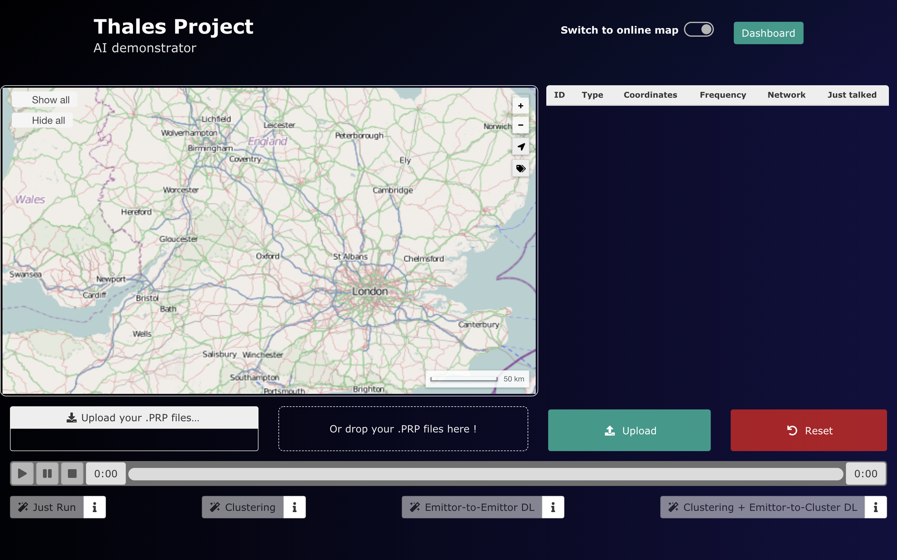

# Thales AI Demonstrator User Manual

## Getting Started

First of all, start up the app using the `start` script. Then, to get to the app, just open a browser on http://localhost:4200/.

You should get a view like this :

There you go, you're ready to use the app. The app is divided into 5 sections.

## Sections of the app

### 1. The Map

In this upper lefts section, the emitters which are discovered and located by the receiving stations will be displayed.
 

### 2. The list of tracked emitters

### 3. The Upload section

### 4. The Simulation control section

### 5. The Live Dashboard

