# Thales AI Demonstrator User Manual!

## Getting Started

First of all, start up the app using the `start` script. Then, to get to the app, just open a browser on http://localhost:4200/

You should get a view like this :

There you go, you're ready to use the app. The app is divided into 5 sections.

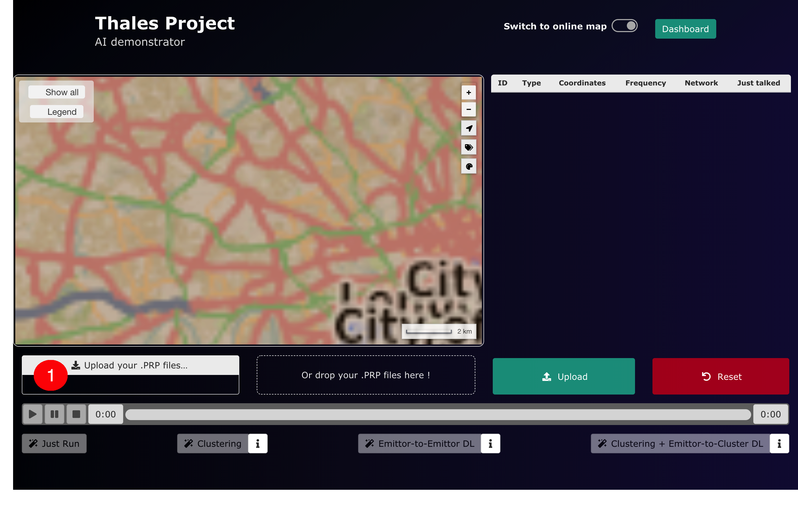

1. Click on this button to upload the stations scenarios as a PRP file.

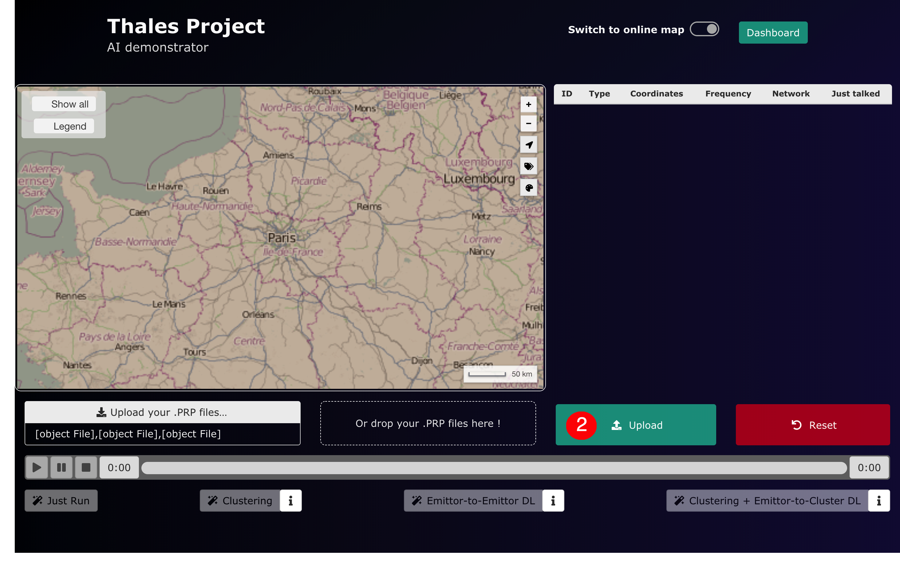

2. Once your PRP files are loaded in the browser, click the upload button.

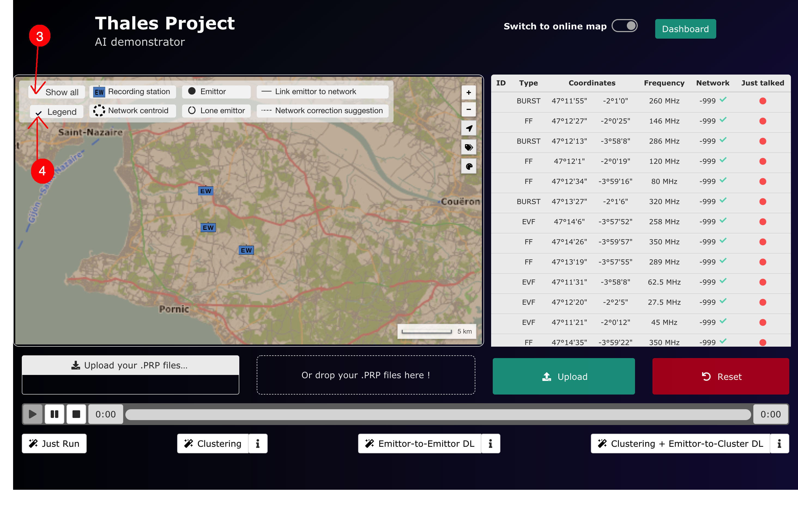

3. Click here to show all the emitters of the uploaded scenario.

4. Click here to show/hide the legend of the map.

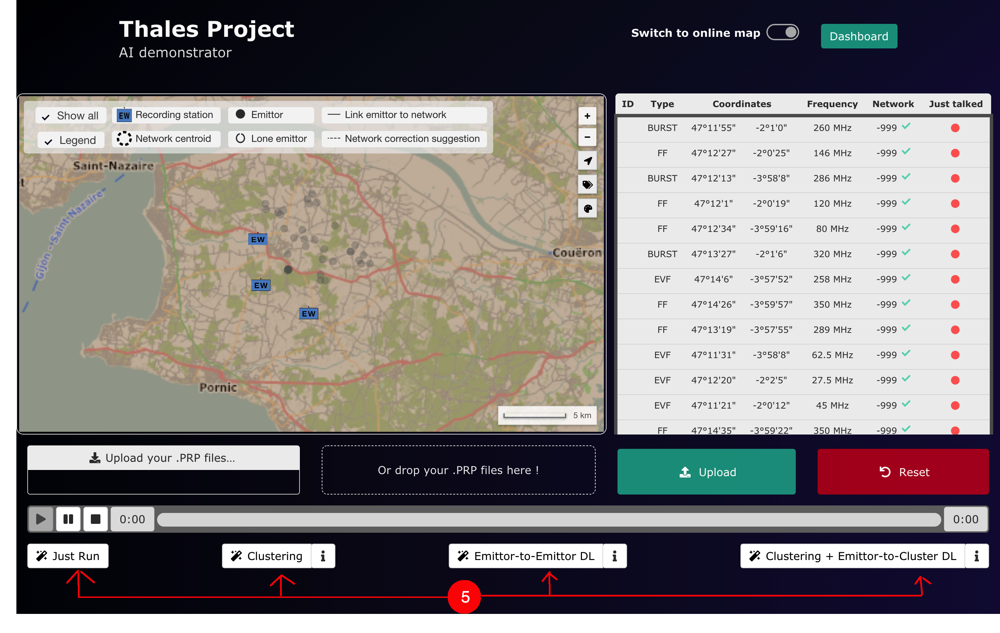

5. You can choose any of the machine learning models to run, or just choose to play the scenario without any model running by clicking "Just Run".

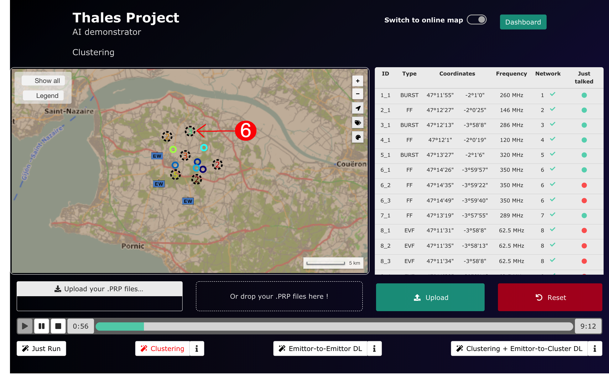

6. You can choose to expand a network by clicking on its centroid.

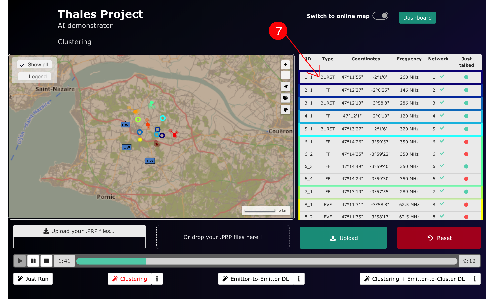

7. The network infos show in this part of the web application, with the tab colors matching the map colors. You can click on a network in this tab to show it on the map. The green tick indicates that the model associated the emitter to a network.

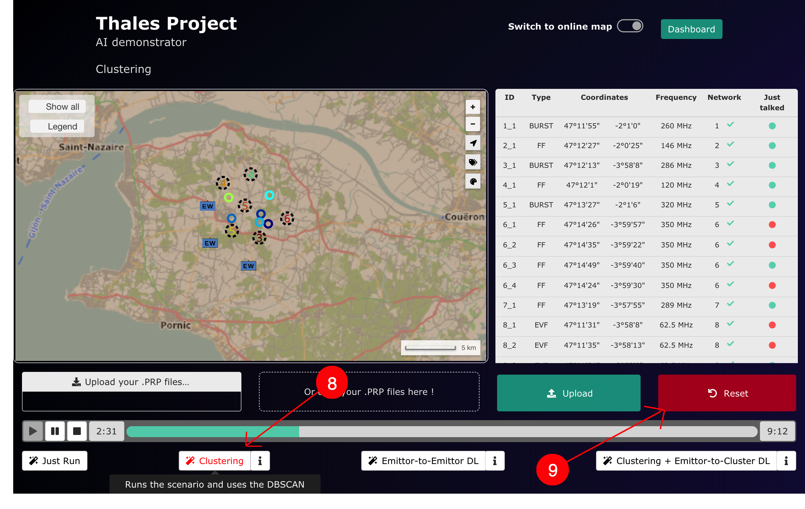

8. You can hover on a model name to find summarized information on the model, or click on the "info" button to show detailled information.

9. You can click here to reset the scenarios uploaded, and upload a new scenario.

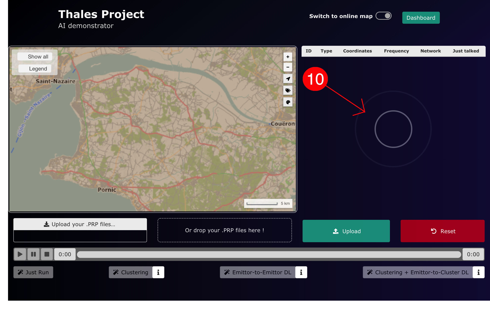

10. This JavaScript animation indicates that the files are being uploaded to the server.

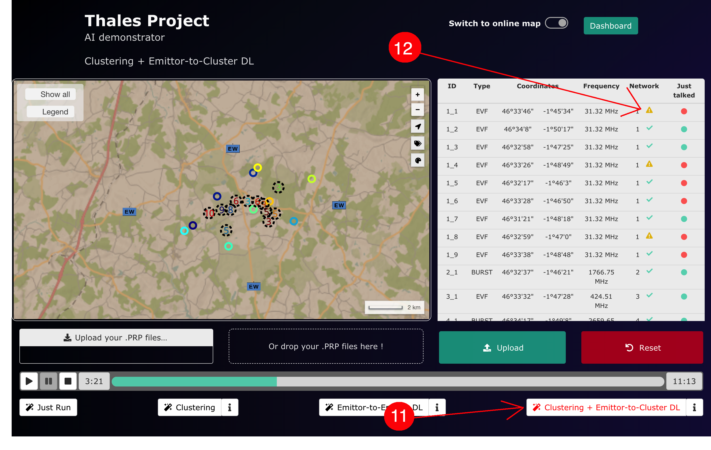

11. We have selected the Clustering+ Emitter-to-Cluster Deep Learning method, so we  run both models.

12. With this Machinle Learning, we have a warning sign indicating that the Deep Learning thinks this emitter could be in a different network based on temporal information.

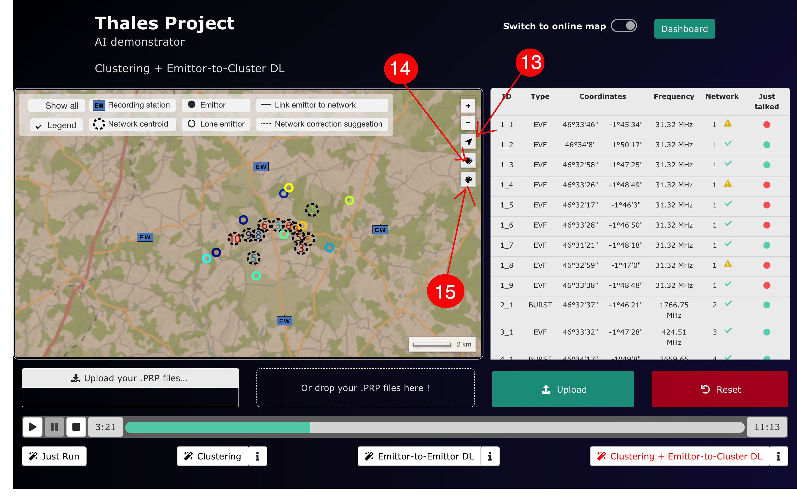

13. This button is used to center the map on a simulation.

14. This button allows you to choose between showing the amount of emittors in a network inside its centroid or the network's number.

15. This button is used to change the color range, to adapt to the background (for instance we don't want yellow color chart on a simulation running in the desert).

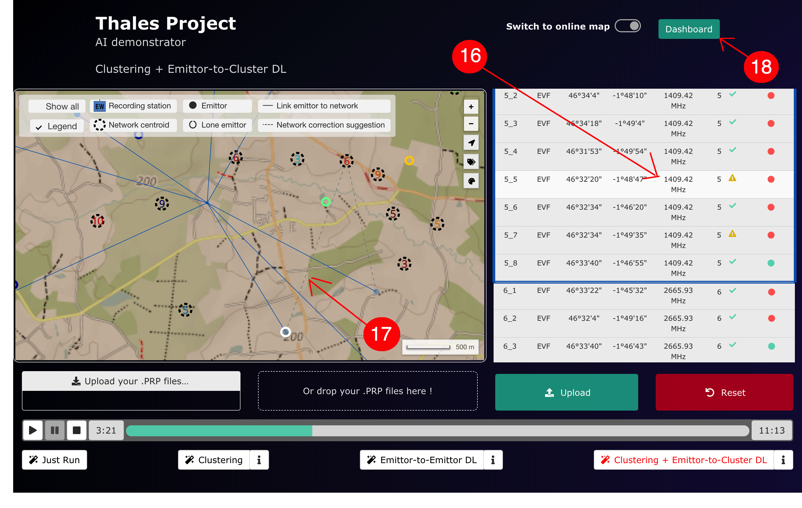

16. If we hover on an emitter in the tab part, it shows on the map with a white circle around it.

17. An emitter with a warning side in the network column will have a dashed line linking it to the network the Deep Learning thinks he belongs to.

18. Click here to open the dashboard to monitor ressources and have more information

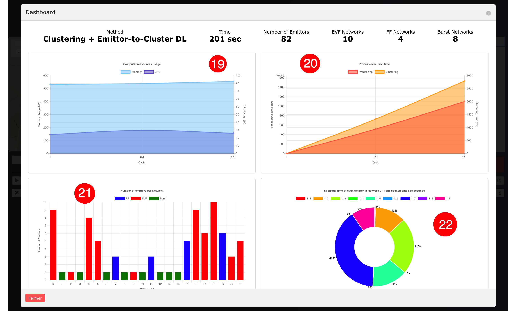

19. This chart shows the ressources dedicated to the execution of the demonstrator.

20. This chart show the time needed to perform clustering and processing operations on server-side.

21. This chart summarizes the different networks, stating the number of emitters per network and the type of emission in the network. You can click on one of the bars to show the infos of it in 22. 

22. This diagram shows the speaking distribution inside a network. 

## Sections of the app

### 1. The Map

In this upper lefts section, the emittors which are discovered and located by the receiving stations will be displayed.
 

### 2. The list of tracked emittors

### 3. The Upload section

### 4. The Simulation control section

### 5. The Live Dashboard

